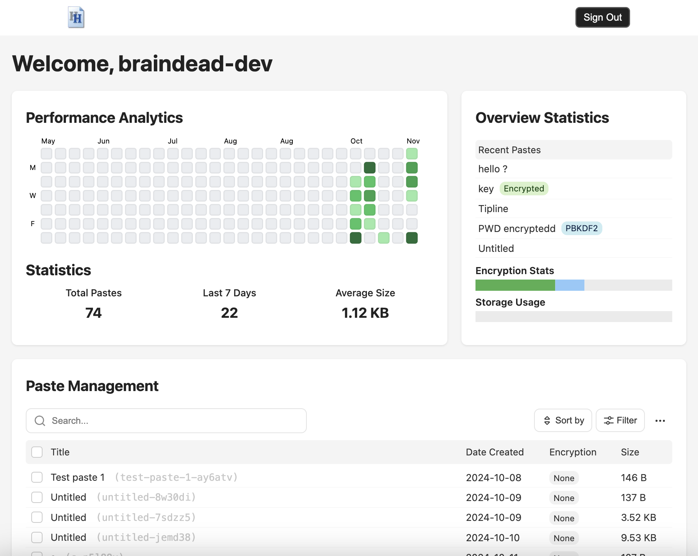

#  notes.henr.ee - Secure Markdown Pastebin

A free, secure pastebin designed for markdown notes with client-side encryption. Built with Next.js, MongoDB, and TypeScript. I began this side project to share markdown notes with my classmates, focusing on an elegant UI and later making it secure.

## Features

### Core Functionality

- **Markdown Support**: Full markdown rendering with support for GFM, KaTeX math, and syntax highlighting
- **Clean UI**: Minimalist interface focused on content creation and readability
- **Free & Permanent**: All pastes are hosted indefinitely at no cost
- **No Account Required**: Create and share pastes without registration
- **Hotkeys:** Use Cmd/Ctrl+E to toggle view mode in the paste editor

### Security

- **Client-Side Encryption**:

  - AES-256-GCM encryption performed entirely in the browser using the [Web Crypto API](https://developer.mozilla.org/en-US/docs/Web/API/Web_Crypto_API)
  - Two encryption methods:
    - Key-based: Uses a generated 256-bit key
    - Password-based: PBKDF2 with 1.5M iterations and SHA-256
  - Zero-knowledge: Server never sees unencrypted content or encryption keys
  - See [cryptoUtils.ts](utils/cryptoUtils.ts)

- **XSS Protection**:
  - Input validation and content sanitization on both client and server
  - Strict CSP and HTTP headers

### Admin Features

<div align="center">

</div>

- **Admin Dashboard**:
  - Real-time statistics and analytics
  - Paste management with search, sort, and filter capabilities
  - Bulk operations (delete, export)
  - Storage usage monitoring
- **Discord Integration**: Webhook notifications for new pastes

## Technology Stack

- **Frontend**: Next.js, TypeScript
- **Backend**: Next.js API Routes, MongoDB
- **Editor**: CodeMirror 6
- **Markdown**: React-Markdown with remark/rehype plugins
- **Authentication**: NextAuth.js (for admin dashboard)
- **Styling**: CSS Modules

## Installation

1. Clone the repository:

```bash
git clone https://github.com/yourusername/notes.henr.ee.git
cd notes.henr.ee
```

2. Install dependencies:

```bash
npm install
```

3. Set up environment variables:

```env
MONGODB_URI=your_mongodb_connection_string
NEXTAUTH_SECRET=your_nextauth_secret
GITHUB_SECRET=your_github_secret
ALLOWED_USERS=adminlist by github uid (ex. "134236009,7150848")
DISCORD_WEBHOOK_URL=your_discord_webhook_url (optional)
```

4. Run the development server:

```bash
npm run dev
```

## License

This project is licensed under the MIT License - see the [LICENSE](LICENSE.md) file for details.

## Contact

For questions or support, please reach out to contact@henrywa[.]ng. Contributions are welcome!

---

_Note: This is an open-source project. While the code is available for learning and reference, please ensure you implement your own security measures and testing before deploying in production._
